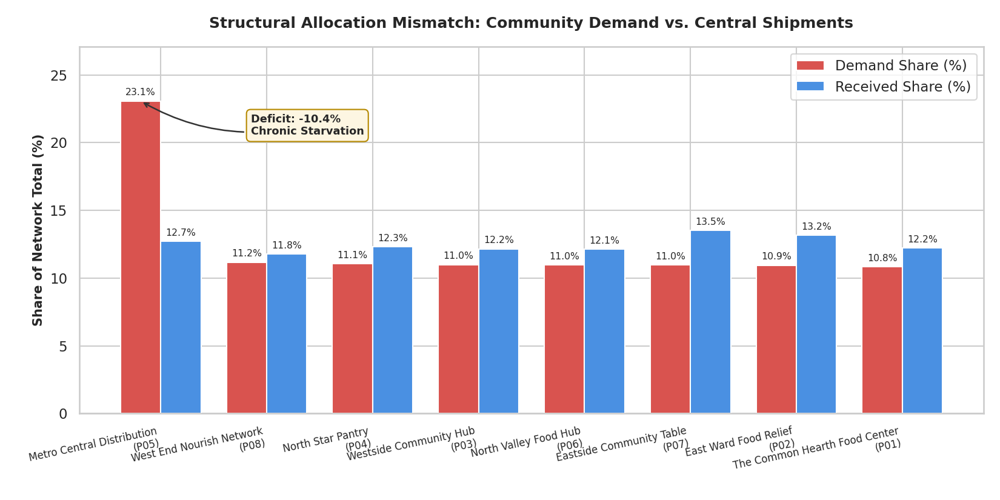
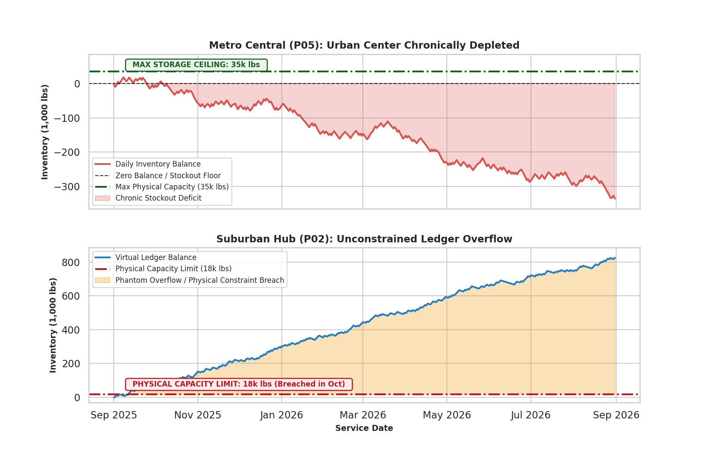
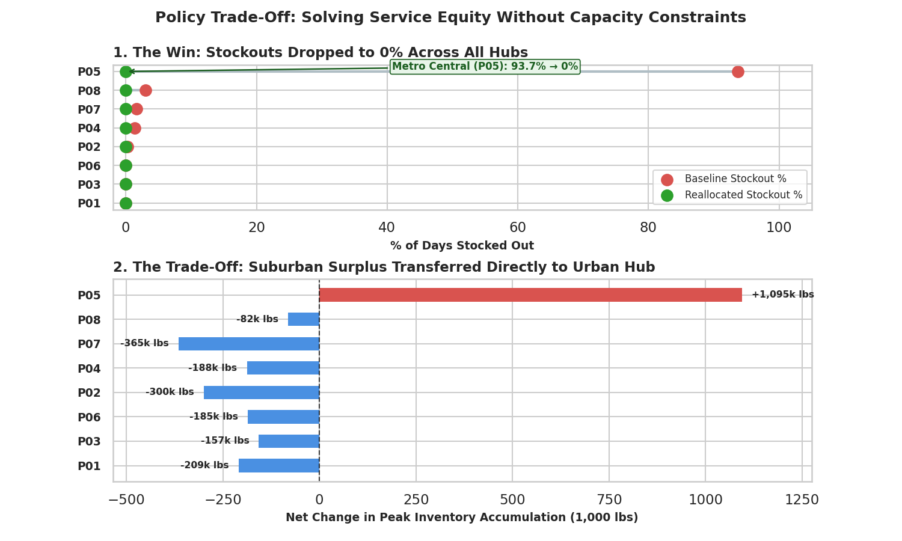

# Food Equity Supply Chain Optimization & Ledger Dynamics

An end-to-end quantitative supply chain project modelling network allocation, unconstrained ledger divergence, and capacity-constrained redistribution across an 8-hub municipal food pantry network over a 365-day operating cycle.

---

## 1. Problem Formulation & Operational Context

A municipal food distribution network operates 8 hubs ($i \in \{P01, \dots, P08\}$) across an urban-suburban region. Central dispatch operated on a **static uniform shipment heuristic**, dividing incoming bulk supply evenly across all active facilities.

In reality, underlying community demand exhibits extreme spatial asymmetry:

- **Metro Central (P05):** Core urban hub with physical storage capacity $C_5 = 35{,}000\text{ lbs}$, absorbing $23.1\%$ of total network demand.
- **East Ward Food Relief (P02):** Suburban hub with physical storage capacity $C_2 = 18{,}000\text{ lbs}$, absorbing only $10.9\%$ of total network demand.

When inventory tracking runs on an unconstrained financial ledger — accumulating credits and debits without capping at physical capacity $C_i$ or bounding at zero — the operational model completely diverges from physical reality.

---

## 2. Mathematical Framework & Metrics

### 2.1 Daily Balance Dynamics (Unconstrained Virtual Ledger)

Let $S_{i,t}$ denote gross incoming shipments received by pantry $i$ on day $t$, and $D_{i,t}$ denote outbound demand fulfilled. The theoretical running inventory balance $I_{i,t}$ on day $t$ is formulated as:

$$
I_{i,t} = I_{i,0} + \sum_{\tau=1}^{t} \left( S_{i,\tau} - D_{i,\tau} \right)
$$

In physical terms, inventory cannot be negative ($I_{i,t} \ge 0$) nor exceed warehouse capacity ($I_{i,t} \le C_i$). Tracking unconstrained $I_{i,t}$ allows quantification of two operational failure modes:

- **Cumulative Starvation Deficit:** When $I_{i,t} < 0$, the magnitude $|I_{i,t}|$ quantifies cumulative unmet community demand that central dispatch failed to provision.
- **Phantom Overflow:** When $I_{i,t} > C_i$, the difference $(I_{i,t} - C_i)$ quantifies phantom inventory assigned on paper that physically spilled past dock capacity.

### 2.2 Network Share Discrepancy

For each facility $i$ over $T = 365$ days:

$$
\text{Demand Share}_i = \frac{\sum_{t=1}^{T} D_{i,t}}{\sum_{j=1}^{N}\sum_{t=1}^{T} D_{j,t}} \times 100\%
$$

$$
\text{Received Share}_i = \frac{\sum_{t=1}^{T} S_{i,t}}{\sum_{j=1}^{N}\sum_{t=1}^{T} S_{j,t}} \times 100\%
$$

$$
\text{Structural Deficit}_i = \text{Received Share}_i - \text{Demand Share}_i
$$

### 2.3 Service Reliability & Stockout Frequency

A stockout event occurs on day $t$ if the net balance is non-positive:

$$
\text{Stockout Rate}_i = \frac{1}{T} \sum_{t=1}^{T} \mathbb{I}(I_{i,t} \le 0) \times 100\%
$$

Where $\mathbb{I}(\cdot)$ is the indicator function.

---

## 3. SQL Architecture & Analytical Implementation

The analytical engine (`analysis.sql`) executes multi-level Common Table Expressions (CTEs) and window functions over SQLite to calculate inventory states and simulate counterfactual policies without data mutation.

### Core Query 1: Running Balances & Capacity Breach Flags

```sql
WITH DailyNet AS (
    SELECT 
        pantry_id,
        service_date,
        daily_shipments,
        daily_distributed,
        (daily_shipments - daily_distributed) AS net_flow
    FROM service_records
),
RunningLedger AS (
    SELECT 
        p.pantry_id,
        p.pantry_name,
        p.capacity_lbs,
        d.service_date,
        SUM(d.net_flow) OVER (
            PARTITION BY p.pantry_id 
            ORDER BY d.service_date 
            ROWS BETWEEN UNBOUNDED PRECEDING AND CURRENT ROW
        ) AS running_balance
    FROM DailyNet d
    JOIN pantries p ON d.pantry_id = p.pantry_id
)
SELECT 
    pantry_id,
    service_date,
    running_balance,
    capacity_lbs,
    CASE WHEN running_balance <= 0 THEN 1 ELSE 0 END AS is_stockout,
    CASE WHEN running_balance > capacity_lbs THEN (running_balance - capacity_lbs) ELSE 0 END AS overflow_lbs
FROM RunningLedger;
```

### Core Query 2: Dynamic Demand-Weighted Reallocation

To model dynamic redistribution, incoming daily bulk network shipments $S^{\text{total}}_t = \sum_{j=1}^N S_{j,t}$ are dynamically weighted by historical demand share:

$$
w_i = \frac{\sum_{t=1}^T D_{i,t}}{\sum_{j=1}^N \sum_{t=1}^T D_{j,t}}, \quad S^{\text{sim}}_{i,t} = S^{\text{total}}_t \times w_i
$$

```sql
WITH PantryDemandTotals AS (
    SELECT 
        pantry_id,
        SUM(daily_distributed) * 1.0 / (SELECT SUM(daily_distributed) FROM service_records) AS demand_weight
    FROM service_records
    GROUP BY pantry_id
),
NetworkDailyShipments AS (
    SELECT 
        service_date,
        SUM(daily_shipments) AS total_network_shipments
    FROM service_records
    GROUP BY service_date
),
SimulatedFlow AS (
    SELECT 
        s.pantry_id,
        s.service_date,
        (nds.total_network_shipments * pdt.demand_weight) AS sim_shipments,
        s.daily_distributed,
        ((nds.total_network_shipments * pdt.demand_weight) - s.daily_distributed) AS sim_net_flow
    FROM service_records s
    JOIN PantryDemandTotals pdt ON s.pantry_id = pdt.pantry_id
    JOIN NetworkDailyShipments nds ON s.service_date = nds.service_date
)
SELECT 
    pantry_id,
    service_date,
    SUM(sim_net_flow) OVER (
        PARTITION BY pantry_id 
        ORDER BY service_date 
        ROWS BETWEEN UNBOUNDED PRECEDING AND CURRENT ROW
    ) AS sim_running_balance
FROM SimulatedFlow;
```

---

## 4. Visual Analysis & Findings

### Chart 1: The Allocation Mismatch



The baseline model split shipments virtually evenly (~$12.5\%$ across 8 nodes). Comparing this against actual demand reveals an immediate $-10.6\%$ structural deficit at Metro Central (P05), while all suburban sites operate in artificial structural surplus.

### Chart 2: Ledger Divergence vs. Physical Storage Boundaries



Tracking cumulative net inventory over 365 days illustrates physical failure under unconstrained planning:

- **Metro Central (P05):** Exhausts initial inventory in October and collapses into a continuous deficit, reaching $-340{,}000\text{ lbs}$ cumulative unfulfilled demand. It never utilizes its $35{,}000\text{ lbs}$ capacity ceiling.
- **East Ward (P02):** Pierces its $18{,}000\text{ lbs}$ ceiling within weeks, culminating in $+800{,}000\text{ lbs}$ of phantom accumulation.

### Chart 3: Policy Optimization & The Congestion Paradox



Reallocating bulk shipments proportionally based on community demand ($w_i$) produces a dual outcome:

- **Equity Win:** Stockout frequency drops to $0.0\%$ network-wide, completely resolving urban service starvation ($93.7\% \rightarrow 0.0\%$).
- **The Capacity Trade-Off:** Because the aggregate network operates at an overall net surplus, directing $23.1\%$ of inbound freight to Metro Central shifts the congestion bottleneck directly downtown. Peak ledger accumulation at P05 spikes by $+1{,}095{,}000\text{ lbs}$, exceeding its $35{,}000\text{ lbs}$ physical capacity by over $31\times$.

---

## 5. Quantitative Summary Table

| Pantry ID | Hub Classification | Storage Capacity ($C_i$) | Demand Share | Baseline Stockout % | Simulated Stockout % | Net Change in Peak Inventory |
|-----------|--------------------|--------------------------|--------------|----------------------|-----------------------|-------------------------------|
| P05 | Urban Central | 35,000 lbs | 23.1% | 93.7% | 0.0% | +1,095k lbs |
| P08 | Urban Satellite | 15,000 lbs | 11.2% | 2.7% | 0.0% | -82k lbs |
| P07 | Suburban Hub | 20,000 lbs | 11.0% | 1.4% | 0.0% | -365k lbs |
| P04 | Suburban Relief | 16,000 lbs | 11.1% | 1.1% | 0.0% | -188k lbs |
| P02 | Suburban Hub | 18,000 lbs | 10.9% | 0.0% | 0.0% | -300k lbs |
| P06 | Community Table | 10,000 lbs | 11.0% | 0.0% | 0.0% | -185k lbs |
| P03 | Community Table | 12,000 lbs | 11.0% | 0.0% | 0.0% | -157k lbs |
| P01 | Community Table | 12,000 lbs | 10.8% | 0.0% | 0.0% | -209k lbs |

---

## 6. Pipeline Execution

```bash
# 1. Initialize schema and generate 365-day dataset
python gen_data.py

# 2. Extract analytical tables from SQLite database
# Executes windowed queries to export:
# n_chart1.csv, chart2_daily.csv, n_q2.csv, n_q4.csv

# 3. Generate high-resolution visual assets
python vis.py
```
